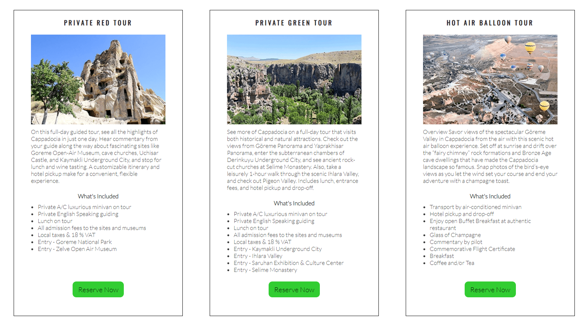
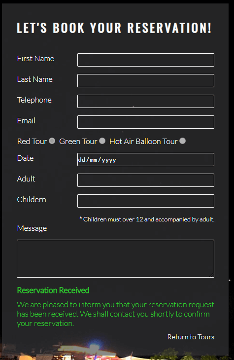
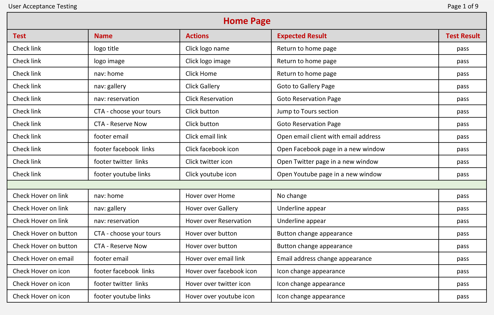
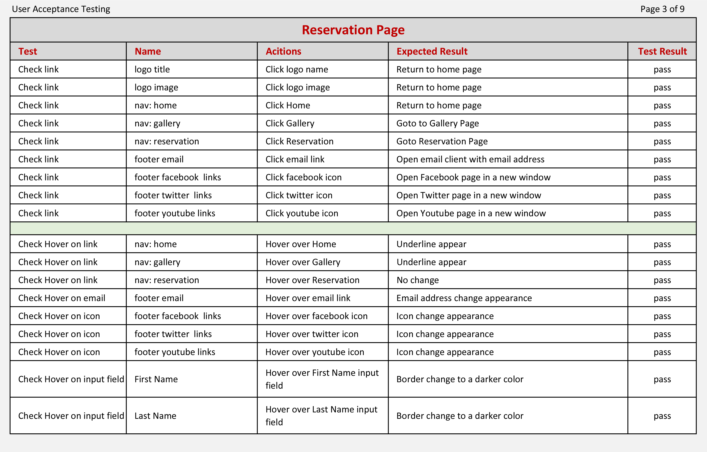
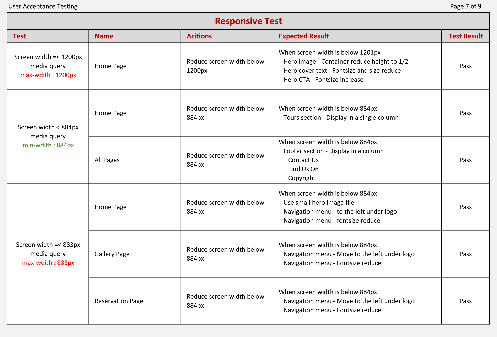
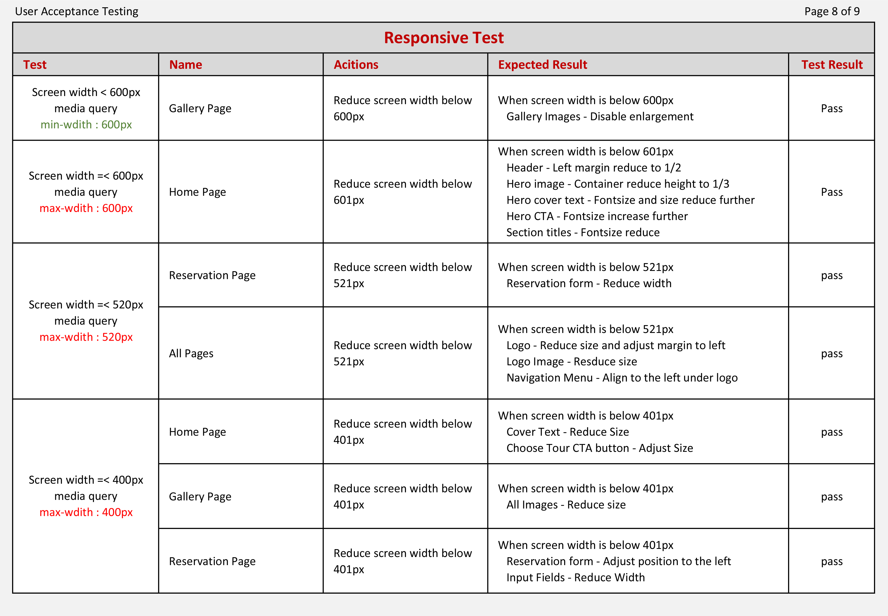
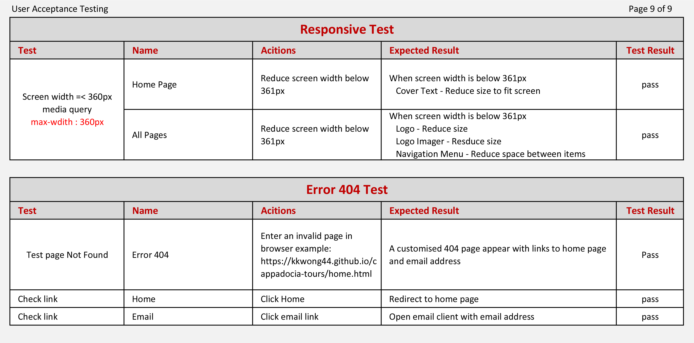

# Cappadocia Tours 
Cappadocia Tour is a company offer local guided tours in the Cappadocia region in Turkey.

Click [here](https://kkwong44.github.io/cappadocia-tours/index.html) to access live site.

The initial phase of this project was completed, published and shared in Github.

*Screenshot - Mockup on Cappadocia Tours Website, generated from [Multi Device Website Mockup Generator](https://techsini.com/multi-mockup/index.php)*

## Objectives

The Company would like to expand their business model by introducing an online reservation booking system to their business. The site will offer the available tours to the tourists in the region and allow them to make reservation.

The target audients will be the tourists travelling to the Cappadocia region and wish to go on guided tours around the region.

For the initial phase of this project, the tours are only available for the 2022 season, 3 tours are available and only 12 images in the gallery.

### Business Goals
* To make an online present
* Increase sales
* Streamline the reservation booking system

### User Goals
* Gain information about the region
* Check and reserve tours in the region

## User Experience Design

### Initial Design
Based on the objectives, wireframes were used to create the initial design of the site. The following are the basic structures of the three pages.

*Wireframe - Home Page*

*Wireframe - Gallery Page*

*Wireframe - Reservation Page*

From the initial design it shows that the site can be broken down into 4 main areas.

1. Common Components section that apply to all pages
2. Home Page that provides information about the region and tours
3. Gallery Page that provide images captured from the tours around the region
4. Reservation Page that allows user to make reservation on a tour

### Common Components
There are three pages on this website for the user to explore. It allows the user to find out about the region, the tours available, browse images in the gallery and make reservation.

The design of this website is to give as much information as possible to the user about the region and the contents of the tours. Also, it provides a gallery that show images related to the tours and encourage the user to make a reservation.

Below are common components across the website:
* All pages contain a logo "Cappadocia Tours", an image logo and a navigation menu at the top of the page
* The site will be directed to the home page when the user clicks on the logo or the image logo
* Navigation menu consist of links to the Home page, Gallery Page and Reservation Page
* User can navigate to these pages by clicking on these links
* All Pages contain a footer. It has 3 section, Contact us with an email link, Copyright and links to Find us on Social Media
* When the email link is clicked. Local email client will be opened with an address to cappadocia tours
* Each social media link will be opened in a new window when its clicked

### Home Page
This page allows the user to discover the region and tours available

The outline of this page is to make an impact to the user with a hero image, the reasons to discover the region and the tours available to explore the region.

Main components of this page:
* A hero image of the Cappadocia region with cover text
* A button link to take the user to the tours section
* Offer tourists an information about Cappadocia region
* Provide information about the tours operate by the company
* Show the available tours and its itineraries
* To make reservation when click on the reserve button

*Screenshot - Home Page in Full*

### Gallery Page
The user can browse through the images display on this page which taken from the tours in the region.

The idea of this page is to encourage the user to visit the region.

Main components of this page:
* This page shows images from the region
* The images are display in a grid format
* Each image can be enlarged when hover on large screen devices

*Screenshot - Gallery Page in Full*

### Reservation Page
This page allows the user to make a reservation.

The information submitted by the user are captured and post processes can be followed up.

Main components of this page:
* The reservation form allows the user to make a reservation
* All input fields except message are required to make reservation
* The input fields will be validated when the submit button is click
* A reset button is available to the user to reset the form with the default values

*Screenshot - Reservation Page in Full*

### Responsive and Accessibility
The website has been developed to be used by as many users as possible and as many devices as possible.

* The site is aim to all devices
* Accessibility has been incorporated into the design

## Features

### Header
All pages have the same header.

The header contents allow user to navigate the site.

This section shows the company name, its image logo and a menu for navigate the site.

    Features on this section:
    * Company Name on the left as part of the logo
    * An image of the logo next to the company name
    * A navigation menu on the right with links to Home page, Gallery page and Reservation page
    * An underline will be appeared under the menu item when hover and disappear when hover away
    * Underline always show under the menu item to indicate the current page

*Screenshot - Header on full desktop screen width*

#### Responsive
User can access to site via different devices.

The site is designed to response and give the best display on different screen width.

    * When the screen width is below 884px, navigation menu will move to the left under the company name
    * Also, the font size on the navigation menu will be reduced

*Screenshot - Company Name and Logo Adjusted on Mobile Devices*

### Footer
All Pages have the same footer.

The footer section allows the user find out more information about the company.

The layout is separated in 3 sections, company contact details, follows the company in social media and the copyright statement.

    Features on this section:
    * Contact details are on the left with an email link
    * Copyright in the centre
    * Find us on social media on the right
    * The email link and the social media icons will be darkened when hover
    * Email client will be opened when clicked
    * A new window will be opened for each social media when clicked

*Screenshot - Footer on full desktop screen width*

#### Responsive
User can access to site via different devices.

The site is designed to response and give the best display on different screen width.

    * When the screen width is below 884px, the 3 sections will stack into a column

*Screenshot - Navigation Menu Adjusted on Mobile Devices*

### Home Page
 The user will be able to explore and discover the tours available on this page. User also allows to jump to the tours section by clicking a button.

 This page is aim to attract the audience by displaying a hero image and offering them information about the region and tours. To help the user quickly to see the tours available, a button is available at the top inside the hero image.

    Features on hero section
    * A hero Image
    * A cover text on the hero image
    * Call to Action button to the tours section

*Screenshot - Hero Section*

    Features on about Cappadocia and Tours section
    * About Discover Cappadocia section
    * About Company tours section

*Screenshot - About Discovery and Tours Sections*

    Features on Guided Tours section
    * Guided Tours section
    * 3 tours are available
    * An image and itineraries for each tour
    * Call to Action button on each tour to direct to reservation page

*Screenshot - Guided Tours on Offer*

#### Responsive
User can access to site via different devices.

The site is designed to response and give the best display on different screen width.

**Features on Responsive**

    When the screen width is below 1200px
    * Hero image - Container reduce height to 1/2
    * Hero cover text - Fontsize and size reduce
    * Hero CTA - Fontsize increase
>
    When the screen width is below 844px
    * Use small hero image file
    * Tours section - Display in a single column
>
    When the screen width is below 600px
    * Hero image - Container reduce height to 1/3
    * Hero cover text - Fontsize and size reduce further
    * Hero CTA - Fontsize increase further
    * Section titles - Fontsize reduce
>
    When the screen width is below 400px
    * Hero cover text - Fontsize and size reduce further
    * Hero CTA - Fontsize increase further
>
    When the screen width is below 360px
    * Hero cover text - Fontsize and size reduce further

*Screenshot - Hero Image Section, Adjusted*

*Screenshot - Guided Tours Section, Adjusted*

### Gallery Page
User can browse the tour images on this page. They can enlarge the image by hovering on the image.

The images are layout in a grid format and designed to encourage user to make reservation. An image enlargement feature is available to allow user a better viewing of the image.

    Features on this page
    * 12 images in the gallery
    * Each image can be enlarged when hover over the image

*Screenshot - Gallery Page in Full Screen*

*Screenshot - Image Enlarged when Hover over the image*

#### Responsive
User can access to site via different devices.

The site is designed to response and give the best display on different screen width.

**Features on Responsive**

    * The screen width will determine number of columns
    * Image enlargement will be disabled when the screen width is below 600px
    * Image size will reduce when screen width is below 400px

*Screenshot - Gallery Page Adjusted to a Single Column on Mobile Device*

### Reservation Page
User can fill in their information on this page and reserve the tour by submitting the form into the system.

The data will be captured and used for post processing by the company.

    Features on this page
    * A reservation form can be filled and submitted to the company
    * All input fields except message are required
    * Each input field will be validated when submit button is clicked
    * Message will be display for missing or invalid data
    * All data can be reset to default values when Reset button is clicked
    * A message will be returned after the form is submitted

*Screenshot - Error Message display after user click on the submit button*

***Confirmation Page is a simulated page to show the reservation has been received. This page is a duplicate of the reservation page but the input fields and buttons have been disabled. An additional link is available to the user for returning to the tours section.***

*Screenshot - Confirmation Message display when form is successfully submitted*

#### Responsive
User can access to site via different devices.

The site is designed to response and give the best display on different screen width.

**Features on Responsive**

    When the screen width is below 520px
    * The width of the Reservation Form will reduce to fit screen

    When the screen width is below 400px
    * The width of the Reservation Form will reduce further to fit screen

*Screenshot - Reservation Form Adjusted on Mobile Devices*

### Customised Error 404 Page
User will see a customised page for Error 404 when a page is not found and allow to return back to the home page.

The customised page enables the user to report the error and offer a link to redirect back to the home page.

*Screenshot - Error 404 Page not Found*

## Future Features
The following features need to be added in the future to create a fully functional website. The main attention is to simplify the processes for returning customers and the maintenance of the site.

### General
    * Create a login page for both new and returning customers
    * Implement security on user and payment data

### Home Page
    * Automatically set the correct tour radio button on the reservation form from the Call to Action button
    * More tours will be added to this page but need to extend to other pages to overcome performance issues
    * Information and tours need to be maintained and updated efficiently

### Gallery Page
    * More images can be added to this page
    * For performance, the gallery may need to extend to additional pages
    * Images need to be maintained and updated efficiently

### Reservation Page
    * Date only accepted beyond the current system date
    * Show available dates for each tour
    * Show available seats for each tour
    * Reservation fee is required and process credit card transaction
    * Confirmation email to user when reservation successfully processed
    * Payment and tour confirmation will be sent out after the reservation has been carried out successfully

## Functional Testing
During the development phase, each feature was tested and ensured that the fundamental functions have achieved before going on to develop the next feature.

Once the site has been created, a full user acceptance testing was carried out to eliminate any bugs, errors or missing functionality. For example,
during the responsive tests, it was identified that the navigation menu was not functioning correctly for all pages. This was caused by the feature was developed on the home page but forgot to implement it to other pages. The tests then repeated until all issues are resolved.

This user acceptance testing was designed with all possible tests to simulate the user actions and the same tests are repeated on the live site to ensure all functionalities are working correctly.

There are 2 main test groups.
* Functional testing on each page
* Responsive testing on multiple devices

### User Acceptance Testing Report

The following report shows the final tests result that have been carried out.

## Validator Testing
Validator testing is used to validate codes that are legally written and to identify any possible errors. This can be done by using online automated testing tools to scan through the codes.
The tools used for this project are
* W3C Markup Validation Service to validate HTML - https://validator.w3.org/
* W3C CSS Validation Service to validate CSS - https://jigsaw.w3.org/css-validator/

The code can be copied and paste directly into the validator to perform the test. A report will be generated with the test results where it identified the errors. The validator will show passed when the code is free of error.

Although the site seems to be functioning correctly but during the initial validation test, it was identified that one of the ID name in the HTML was not unique and used in several places. This was rectified then the process repeated and passed the test.

### Validation Reports
The following reports show all HTML pages and CSS code have passed the test.

*Home Page - index.html*

*Gallery Page - gallery.html*

*Reservation Page - reservation.html*

*Confirmation Page - confirmation.html*

*Error 404 Page - 404.html*

*Stylesheet - style.css*

## Performance and Accessibility Testing
Lighthouse is a tool in Chrome Development Tools that allows developer to test their website. Performance and Accessibility are two of the tests carried out by Lighthouse and it can identify where you can improve the performance and accessibility.

The performance testing was carried out on the site and shows each page can be improved on the images that were used. There were several attempts to improve the performance by reducing dimensions, file sizes and file formats. The test cycle was repeated on each attempt and the final version was to use the minimum dimensions on each image, convert into Webp from Jpg format and optimize the file size by using image optimiser tool.

All images are optimised, uploaded and use in the live site.

From the lighthouse reports at below, it shows the site perform well. The site was physically tested on several devices from desktops, tablets and mobile phones. The performance on these devices were operated normally and without lagging.

*Lighthouse Report on index.html*

*Lighthouse Report on gallery.html*

*Lighthouse Report on reservation.html*

*Lighthouse Report on confirmation.html*

## Unfixed Bugs
Currently, the reservation page is not fully developed. There is no backend to support the site and the submission of the form is only simulated by returning a Reservation Received message.

The validation and implementation to the backend is out of this project scope but it can be developed in future to become a fully operational website.

## Deployment
### Tools
* GitHub is a code hosting platform for version control and collaboration
* Gitpod is a ready-to-code developer environment

### Development processes

* All the development works are carried out in Gitpod
* Create a repository in Github through Gitpod
* Start the project from a boilerplate written by Code Institue. The full template can be copied from [here](https://github.com/Code-Institute-Org/gitpod-full-template)

    **Repeat the following until project completion**

* Developing your site, save your project in your Gitpod workspaces
* Use git add command to add files to local repository
* Use git commit command to commit the changes to local repository

### Deployment to Github Pages

* Use git push to upload local repository content (Gitpod) to a remote repository (Github)

    **The published site link can be found from your Github repository setting.**

* Select setting from your github repository
* Select Pages on the left hand side menu as shown below
* Under the Source section, you need to select main from Branch in order to publish the site
* You can suspend the published site by selecting none from Branch in the source section

In order to commit any new changes to the live site, always perform git push to upload the latest version of the development code to the remote repository.

*Screenshot - Github Pages*

The live site for this project is published under [https://kkwong44.github.io/cappadocia-tours/](https://kkwong44.github.io/cappadocia-tours/)

***You can use GitHub Desktop to clone and fork repositories that exist on GitHub.***

Click [here](https://docs.github.com/en/desktop/contributing-and-collaborating-using-github-desktop/adding-and-cloning-repositories/cloning-and-forking-repositories-from-github-desktop) for more information on Cloning and forking repositories from GitHub Desktop.

## Credits
### Content
The content of the website is an adaptation of the Love Running project. Initially the HTML was based on the Love Running project but found the code become cumbersome as the development progress. Then I have decided to use flexbox feature to rewrite some of the sections like the footer and the reservation form.

The information and description of Cappadocia tours are from the following websites:

* interpid - [https://www.intrepidtravel.com](https://www.intrepidtravel.com/) 
* Viator - [https://www.viator.com/](https://www.viator.com/)

The footer icons for the Social Media are from:

* Font Awesome website - [https://fontawesome.com/](https://fontawesome.com/)

Website favicon was generated from:

* favicon - [https://favicon.io/](https://favicon.io/)

The image zoom technique is based on the example from:

* W3schools - [https://www.w3schools.com/howto/howto_css_zoom_hover.asp](https://www.w3schools.com/howto/howto_css_zoom_hover.asp)

The flexbox techniques are based on the following youtube videos and websites

* Flexbox challenge - [https://flexboxfroggy.com/](https://flexboxfroggy.com/)
* Youtube by Thomas Bradley on flexbox columns - [https://www.youtube.com/watch?v=P2oSp_N-I7s](https://www.youtube.com/watch?v=P2oSp_N-I7s)
* Youtube by LearnWebCode on Flexbox Tutorial - [https://www.youtube.com/watch?v=k32voqQhODc](https://www.youtube.com/watch?v=k32voqQhODc)

During this development phase I need a temporary solution to simulate a response from the system when a user submitted the form. The solution I found is from W3schools that allows to simulate this action. It is a simple 'onclick event' script to display text.

* W3schools onclick event - [https://www.w3schools.com/jsref/event_onclick.asp](https://www.w3schools.com/jsref/event_onclick.asp)

### Media
The images used in this website are from the following:

* The image logo has been edited and from [Pixabay.com](https://pixabay.com/)
* The photo images are taken by myself and copyright free

## Tools
The tools used to carry out the development on this project are:

* Gitpod and Github
* Image editor - Adobe Photoshop
* Image file size optimiser - [tinypng.com](https://tinypng.com/)
* File format conversion from Jpeg to Webp - [convertio.co](https://convertio.co/jpg-webp/)
* Chrome Dev Tools
* W3C validators
* Webpage Screenshots - Chrome app extension (FireShot)
* WAVE Web Accessibility Evaluation Tool - [https://wave.webaim.org/](https://wave.webaim.org/)

## Acknowledgment
I would like to thank the following to support the development of this website.

* Learning Support - [Code Institute](https://codeinstitute.net/)
* Mentoring Support - [Daisy McGirr](https://github.com/Daisy-McG)