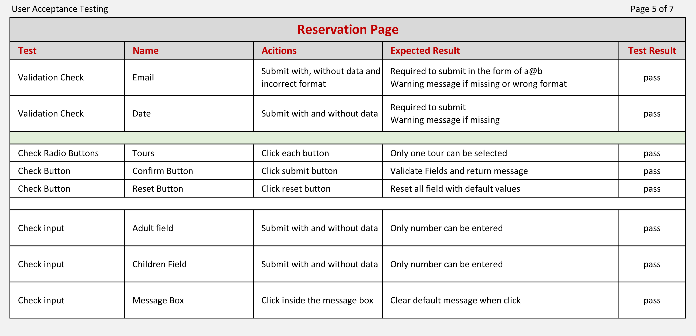

# Cappadocia Tours 

Cappadocia Tour is a company offer local guided tours in the Cappadocia region in Turkey.

## Objectives

The Company would like to expand their business model by introducing an online reservation booking system to their business. The site will offer the available tours to the tourists in the region and allow them to make reservation.

The target audients will be the tourists travelling to the Cappadocia region and wish to go on guided tours around the region.

For the initial phase of this project, the tours are only available for the 2022 season, 3 are available and only 12 images in the gallery.

### Business Goals
* To make an online present
* Increase sales
* Streamline the reservation booking system

### User Goals
* Gain information about the region
* Check and reserve tours in the region

Click [here](https://kkwong44.github.io/cappadocia-tours/index.html) to access phase 1 project.

Multi Device Website Mockup Generator
>

>

## User Experience Design

### General
* All pages contain a logo "Cappadocia Tours", an image logo and a navigation menu at the top of the page
* The site will be directed to the home page when the user click on the logo or the image logo
* Navigation menu consist of links to the Home page, Gallery Page and Reservation Page
* User can navigate to these pages by clicking on these links
* All Pages contain a footer. It has 3 section, Contact us with an email link, Copyright and links to Find us on Social Media
* When the email link is clicked. Local email client will be opened with an address to cappadocia tours
* Each social media link will be opened in a new window when its clicked

### Home Page
* A hero image of the Cappadocia region with cover text
* A button link to take the user to the tours section
* Offer tourists an information about Cappadocia region
* Provide information about the tours operate by the company
* Show the available tours and its itineraries
* To make reservation when click on the reserve button

### Gallery Page
* This page shows images from the region
* The images are display in a grid format
* Each image can be enlarge when hover on large screen devices

### Reservation Page
* The reservation form allows the user to make a reservation
* All input fields except message are required to make reservation
* The input fields will be validated when the submit button is click
* A reset button is available to the user to reset the form with the default values

### Responsive and Accessibility
* The site is aim to all devices
* Accessibility has been incorporated into the design

## Features

### Header
All pages have the same header.

    * Company Name on the left as part of the logo
    * An image of the logo next to the company name
    * A navigation menu on the right with links to Home page, Gallery page and Reservation page
    * An underline will be appeared under the menu item when hover and disappear when hover away
    * Underline always show under the menu item to indicate the current page
#### Responsive
    * When the screen width is below 900px, navigation menu will move to the left under the company name
    * Also, the font size on the navigation menu will be reduced

### Footer
All Pages have the same footer.
    * Contact details are on the left with an email link
    * Copyright in the centre
    * Find us on social media on the right
    * The email link and the social media icons will be darkened when hover
    * Email client will be opened when clicked
    * A new window will be opened for each social media when clicked
#### Responsive
    * When the screen width is below 900px, the 3 sections will stack into a column

### Home Page
    * A hero Image
    * A cover text on the hero image
    * Call to Action button to the tours section
>
    * About Discover Cappadocia section
    * About Company tours section
>
    * Guided Tours section
    * 3 tours are available
    * An image and itineraries for each tour
    * Call to Action button on each tour to direct to reservation page
>

#### Responsive
    * When the screen width is below 1200px
        * Hero image - Container reduce height to 1/2
        * Hero cover text - Fontsize and size reduce
        * Hero CTA - Fontsize increase
>
    * When the screen width is below 900px
        * Use small hero image file
        * Tours section - Display in a single column
>
    * When the screen width is below 600px
        * Hero image - Container reduce height to 1/3
        * Hero cover text - Fontsize and size reduce further
        * Hero CTA - Fontsize increase further
        * Section titles - Fontsize reduce

### Gallery Page
    * 12 images in the gallery
    * Each image can be enlarged when hover over the image
>

#### Responsive
    * The screen width will determine number of columns
    * When the screen width is below 600px
        * Image enlarge will be disabled

### Reservation Page
    * A reservation form can be filled and submitted to the company
    * All input fields except message are required
    * Each input field will be validated when submit button is clicked
    * Message will be display for missing or invalid data
    * All data can be reset to default values when Reset button is clicked
    * A message will be returned after the form is submitted
>

#### Responsive
    * When the screen width is below 520px
        * The width of the Reservation Form will reduce

## Future Features
### Home Page
    * The tour selected from the Call to Action button will automatically set as default in the reservation form
    * More tours will be added to this page but need to extend to other pages for performance issues
    * Information and tours need to be maintained and updated efficiently

### Gallery Page
    * More images can be added to this page
    * For performance issues, the gallery my need to extend to additional pages
    * Images need to be maintained and updated efficiently

### Reservation Page
    * Date need to be beyond the current system date
    * Show available dates for each tour
    * Show available seats for each tour
    * Reservation fee is required and process credit card transaction
    * Confirmation email when reservation successfully processed
    * Payment and tour confirmation will be sent out after the reservation has been carried out successfully

## Functional Testing
During the development phase, each feature was tested and ensured that the fundamental functions have achieved before going on to develop the next feature.

Once the site has been created, a full user acceptance testing was carried out to eliminate any bugs, errors or missing functionality. For example,
during the responsive tests, it was identified that the navigation menu was not functioning correctly for all pages. This was caused by the feature was developed on the home page but forgot to implement it to other pages. The tests then repeated until all issues are resolved.

This user acceptance testing was designed with all possible tests to simulate the user actions and the same tests are repeated on the live site to ensure all functionalities are working correctly.

There are 2 main test groups.
* Functional testing on each page
* Responsive testing on multiple devices

The following report shows the final tests result that have been carried out.

### User Acceptance Testing Report

## Validator Testing
Validator testing is used to validate codes that are legally written and to identify any possible errors. This can be done by using online automated testing tools to scan through the codes.
The tools used for this project are
* W3C Markup Validation Service to validate HTML - https://validator.w3.org/
* W3C CSS Validation Service to validate CSS - https://jigsaw.w3.org/css-validator/

The code can be copied and paste directly into the validator to perform the test. A report will be generated with the test results where it identified the errors. The validator will show passed when the code is free of error.

Although the site seems to be functioning correctly but during the initial validation test, it was identified that one of the ID name in the HTML was not unique and used in several places. This was rectified then the process repeated and passed the test.
# INSERT TEST RESULTS HERE

## Performance and Accessibility Testing
Lighthouse is a tool in Chrome Development Tools that allows developer to test their website. Performance and Accessibility are two of the tests carried out by Lighthouse and it can identify where you can improve the performance and accessibility.

The performance testing was carried out on the site and shows each page can be improved on the images that are used. There were several attempts to improve the performance by reducing dimensions, file sizes and file formats. The test cycle was repeated on each attempt and the final version was to use the minimum dimensions on each image, convert into Webp from Jpg format and optimize the file size by using image optimiser tool.

From the lighthouse reports, it shows the site perform well on desktop and acceptable on mobile devices. I have physically tested the site on tablet and mobile phone and the performance seems to be normal and without lagging.

# TEST RESULTS NEED TO BE UPDATED HERE

## Unfixed Bugs
Currently, the reservation page is not fully developed. There is no backend to support the site and the submission of the form is only a simulation by returning an error message on the system.

The validation and implementation to the backend is out of this project scope but it can be developed in future to become a fully operational website.

At this stage performance issues on mobile devices is beyond my scope. In order to fine turn this site, further research and investigation is needed to improve the performance on mobile devices.

## Deployment
### Tools
* GitHub is a code hosting platform for version control and collaboration
* Gitpod is a ready-to-code developer environments

### Development processes

* All the development works are carried out in Gitpod
* Create a repository in Github through Gitpod
* Start the project from a boilerplate written by Code Insititue. The full template can be copied from [here](https://github.com/Code-Institute-Org/gitpod-full-template)

    **Repeat the following until project completion**

* Developing your site, save your project in your Gitpod workspaces
* Use git add command to add files to local repository
* Use git commit command to commit the changes to local repository
* Use git push to upload local repository content to a remote repository

    **After git push is carried out, a site link can be found from your Github repository setting.**

* Select setting from your github repository
* Select Pages on the left hand side menu
* Under the Source section, you need to select main from Branch in order to publish the site
* You can suspend the published site by selecting none from the source section
>

The live site for this project is published under [https://kkwong44.github.io/cappadocia-tours/](https://kkwong44.github.io/cappadocia-tours/)

**You can use GitHub Desktop to clone and fork repositories that exist on GitHub.**

Click [here](https://docs.github.com/en/desktop/contributing-and-collaborating-using-github-desktop/adding-and-cloning-repositories/cloning-and-forking-repositories-from-github-desktop) for more information on Cloning and forking repositories from GitHub Desktop.

## Credits
### Content
The content of the website is an adaptation of the Love Running project. Initially the HTML was based on the Love Running project but found the code become cumbersome as the development progress. Then I have decided to use flexbox feature to rewrite some of the sections like the footer and the reservation form.

The information and description of Cappadocia tours are from the following websites:

* interpid - [https://www.intrepidtravel.com](https://www.intrepidtravel.com/) 
* Viator - [https://www.viator.com/](https://www.viator.com/)

The footer icons for the Social Media are from:

* Font Awesome website - [https://fontawesome.com/](https://fontawesome.com/)

The image zoom technique is based on the example from:

* W3schools - [https://www.w3schools.com/howto/howto_css_zoom_hover.asp](https://www.w3schools.com/howto/howto_css_zoom_hover.asp)

The flexbox techniques are based on the following youtube videos and websites

* Flexbox challenge - [https://flexboxfroggy.com/](https://flexboxfroggy.com/)
* Youtube by Thomas Bradley on flexbox columns - [https://www.youtube.com/watch?v=P2oSp_N-I7s](https://www.youtube.com/watch?v=P2oSp_N-I7s)
* Youtube by LearnWebCode on Flexbox Tutorial - [https://www.youtube.com/watch?v=k32voqQhODc](https://www.youtube.com/watch?v=k32voqQhODc)

During this development phase I need a temporary solution to simulate a response from the system when a user submitted the form. The solution I found is from W3schools that allows to simulate this action. It is a simple 'onclick event' script to display text.

* W3schools onclick event - [https://www.w3schools.com/jsref/event_onclick.asp](https://www.w3schools.com/jsref/event_onclick.asp)

### Media
* The image logo has been edited and from [Pixabay.com](https://pixabay.com/)
* The photo images are taken by myself and copyright free

## Tools
* Gitpod and Github
* Image editor - Adobe Photoshop
* Image file size optimiser - [tinypng.com](https://tinypng.com/)
* File format conversion from Jpeg to Webp - [convertio.co](https://convertio.co/jpg-webp/)
* Chrome Dev Tools
* W3C validators
* Webpage Screenshots - Chrome app extension (FireShot)
* WAVE Web Accessibility Evaluation Tool - [https://wave.webaim.org/](https://wave.webaim.org/)

## Acknowledgment
* Learning Support - [Code Insititue](https://codeinstitute.net/)
* Mentoring Support - [Daisy McGirr](https://github.com/Daisy-McG)